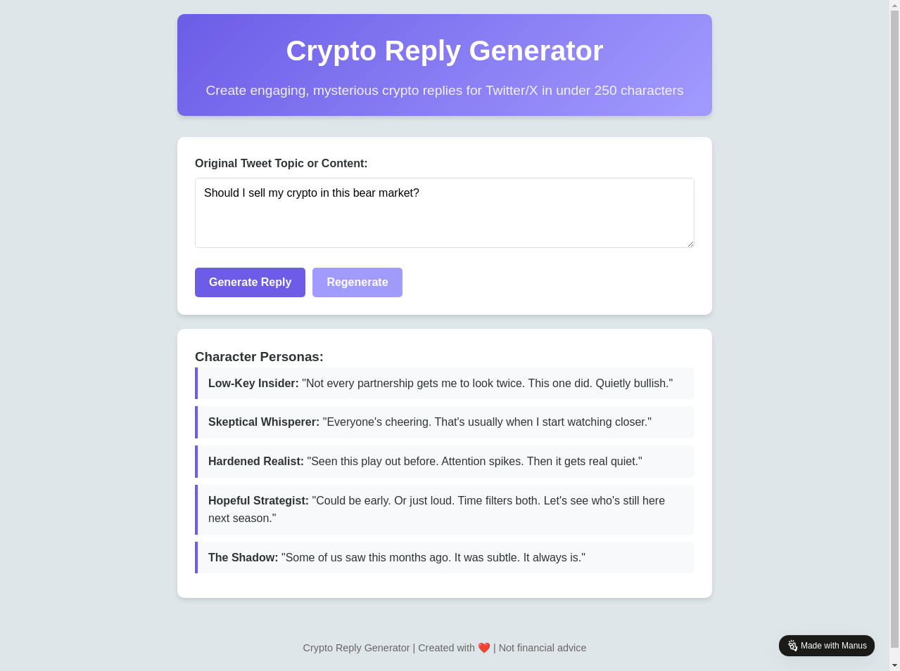

# Twitter Crypto Bot

A sophisticated Twitter automation bot that finds high-engagement cryptocurrency tweets and replies with intelligent, persona-based responses.



## Features

- **Automated Tweet Discovery**: Finds high-engagement cryptocurrency-related tweets
- **Smart Reply Generation**: Creates replies using multiple distinct character personas
- **Context-Aware Responses**: Analyzes tweet content to generate relevant replies
- **Rate Limit Handling**: Built-in protection against Twitter API limits
- **Reply History Tracking**: Prevents duplicate replies to the same tweets

## Character Personas

The bot uses three distinct personas to keep replies fresh and engaging:

1. **Mysterious Insider**: Cryptic, professional tone with insider hints and subtle reverse psychology
2. **Low-Key Expert**: Casual, conversational insights with hints of deeper knowledge
3. **Casual Friend**: Friendly, relatable tone with light humor and curiosity-sparking comments

## Requirements

- Python 3.7+
- Twitter Developer Account with API access
- Twitter API credentials (API key, secret, bearer token, access token, access token secret)

## Installation

1. Clone this repository:
   ```bash
   git clone https://github.com/yourusername/twitter-crypto-bot.git
   cd twitter-crypto-bot
   ```

2. Install dependencies:
   ```bash
   pip install -r requirements.txt
   ```

3. Set up environment variables with your Twitter API credentials:
   ```bash
   # Linux/macOS
   export TWITTER_API_KEY="your_api_key"
   export TWITTER_API_SECRET="your_api_secret"
   export TWITTER_ACCESS_TOKEN="your_access_token"
   export TWITTER_ACCESS_SECRET="your_access_token_secret"
   export TWITTER_BEARER_TOKEN="your_bearer_token"
   
   # Windows
   set TWITTER_API_KEY=your_api_key
   set TWITTER_API_SECRET=your_api_secret
   set TWITTER_ACCESS_TOKEN=your_access_token
   set TWITTER_ACCESS_SECRET=your_access_token_secret
   set TWITTER_BEARER_TOKEN=your_bearer_token
   ```

## Usage

Run the bot manually:
```bash
python twitter_bot.py
```

For detailed setup instructions including cloud deployment options, see [SETUP.md](SETUP.md).

## Customization

The bot is designed to be easily customizable:

- Modify search queries in the `search_crypto_tweets` function
- Adjust engagement thresholds to target more or fewer tweets
- Customize reply templates for each persona in the `generate_template_reply` function
- Add new personas or context categories

## Security Best Practices

- Never commit API credentials to version control
- Regularly rotate your access tokens
- Monitor your Twitter API usage
- Keep your bot code in a private repository if it contains sensitive information

## Deployment Options

The bot can be deployed in various ways:

- **Manual execution**: Run the script when needed
- **Scheduled execution**: Use cron jobs or task schedulers
- **Cloud deployment**: AWS Lambda, Heroku, GitHub Actions, etc.

See [SETUP.md](SETUP.md) for detailed deployment instructions.

## Contributing

Contributions are welcome! If you'd like to improve this bot or have suggestions, please feel free to:

1. Fork the repository
2. Create a feature branch
3. Submit a pull request

## Contact

For questions, customization requests, or collaboration opportunities, contact:
- Telegram: [@balcansatoshi](https://t.me/balcansatoshi)

## License

This project is licensed under the MIT License - see the LICENSE file for details.

## Disclaimer

This bot is provided for educational and research purposes only. Use responsibly and in compliance with Twitter's terms of service and developer agreement. The creator is not responsible for any account suspensions or other consequences resulting from the use of this bot.
